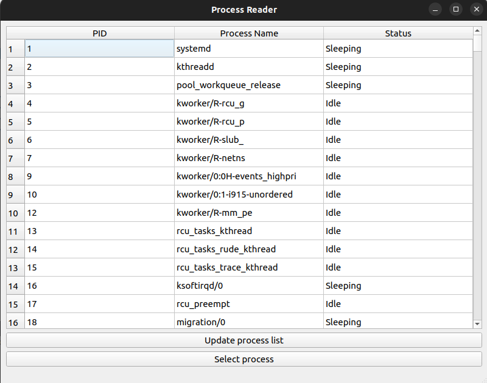
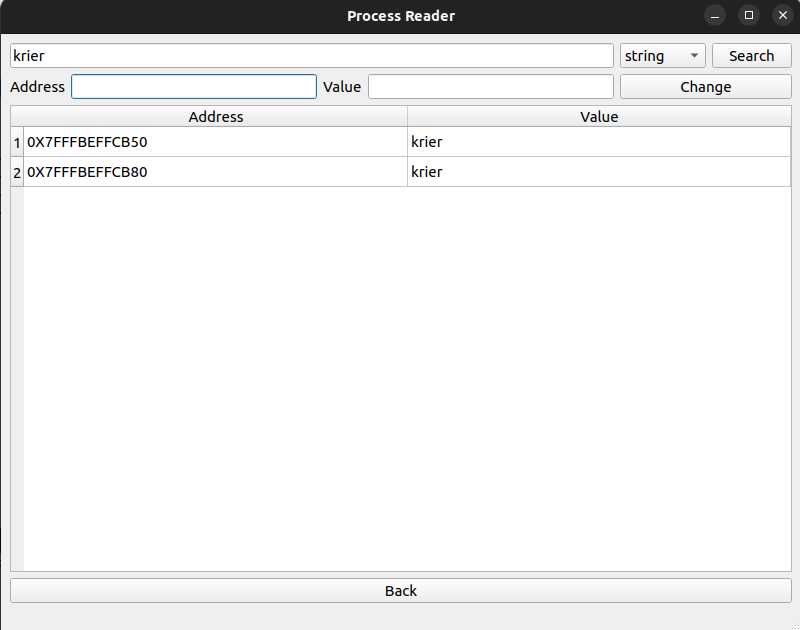
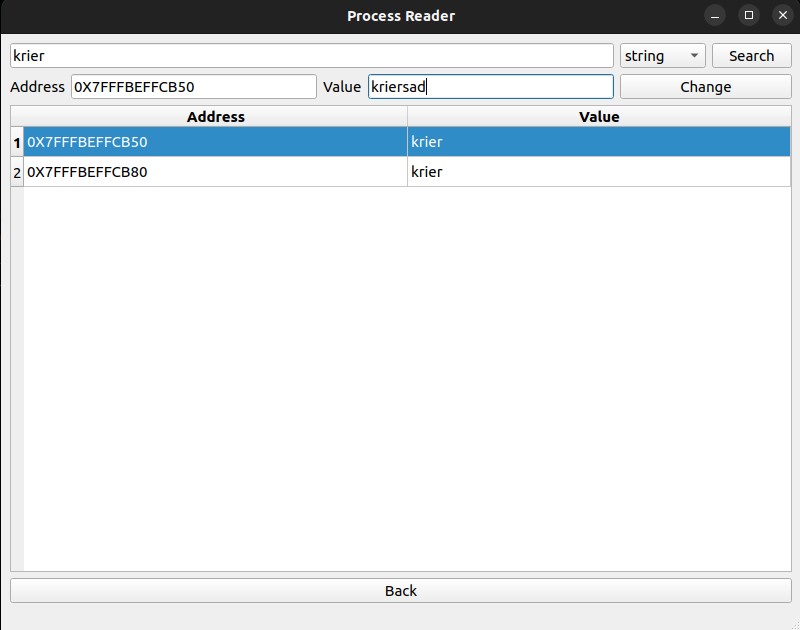

# Webbis Process Analyzer 🔍

**Инструмент для анализа и модификации памяти процессов Linux**

  
  

## 🎯 Обзор

**Webbis Process Analyzer** — это инструмент для анализа и модификации памяти процессов в Linux системах. Разработанный на современном C++23 с использованием фреймворка Qt, он предоставляет интуитивно понятный графический интерфейс для инспекции памяти, поиска и модификации значений в реальном времени.

### ✨ Ключевые возможности

- **🔄 Мониторинг процессов** — обновляемый список процессов с отображением статусов
- **🔍 Поиск в памяти** — поиск значений (целые числа, числа с плавающей точкой, строки) по всей памяти процесса
- **✏️ Модификация памяти** — безопасное изменение значений в запущенных процессах
- **📊 Интеллектуальная фильтрация** — автоматическое пропускание системных, GPU и библиотечных регионов памяти
- **🌍 Многоязычная поддержка** — полная интернационализация (русский/английский)
- **📈 Профессиональная система логирования** — детальное логирование для отладки и аудита
- **🎯 Типобезопасные операции** — поддержка всех примитивных типов данных и строк

## 🛠️ Технологический стек

### Основные технологии
- **Язык**: C++23 (современные возможности включая `std::format`, `std::variant`, `std::jthread`)
- **GUI Фреймворк**: Qt5/Qt6 с нативными виджетами
- **Система сборки**: CMake с современными практиками
- **Доступ к памяти**: системные вызовы Linux `process_vm_readv`/`process_vm_writev`
- **Конкурентность**: `std::thread` с синхронизацией через `std::atomic`

### Архитектурные особенности
- **Чистое разделение**: MVC-подобная архитектура с четким разделением UI, бизнес-логики и доступа к данным
- **Безопасность исключений**: комплексная обработка исключений с иерархией пользовательских исключений
- **Управление ресурсами**: паттерн RAII по всему коду, умные указатели для владения
- **Потокобезопасность**: lock-free алгоритмы где возможно, атомарные операции для общего состояния

    
    
    

